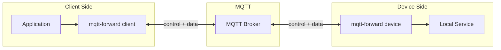
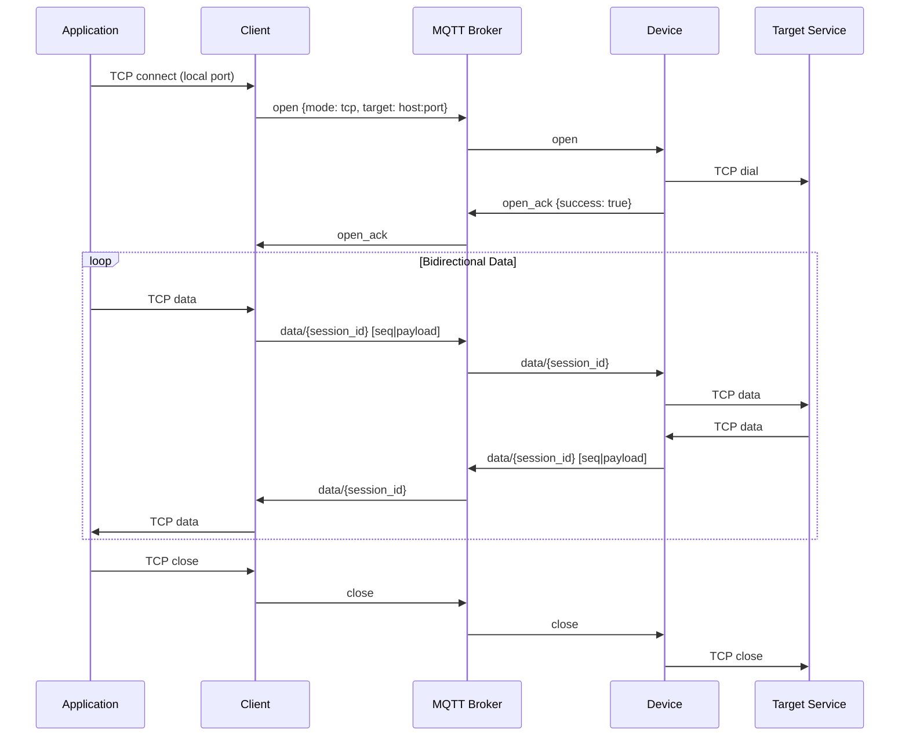
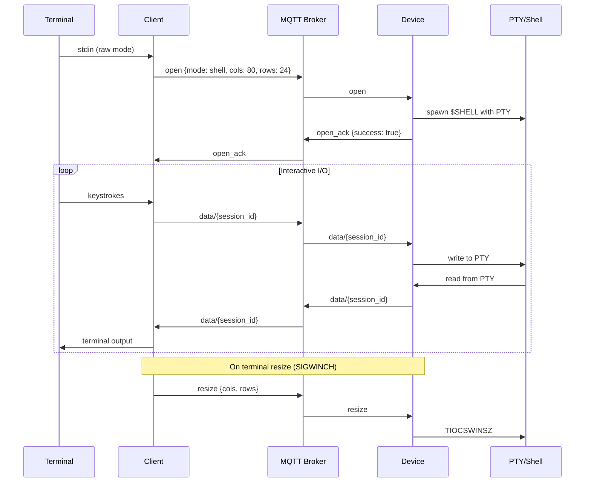
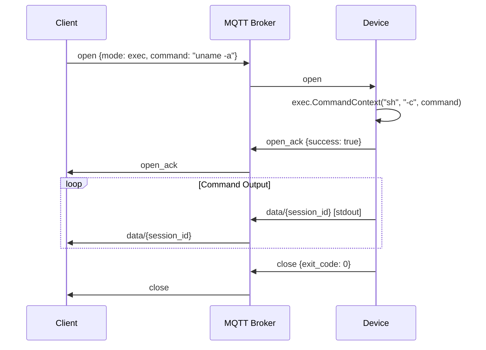
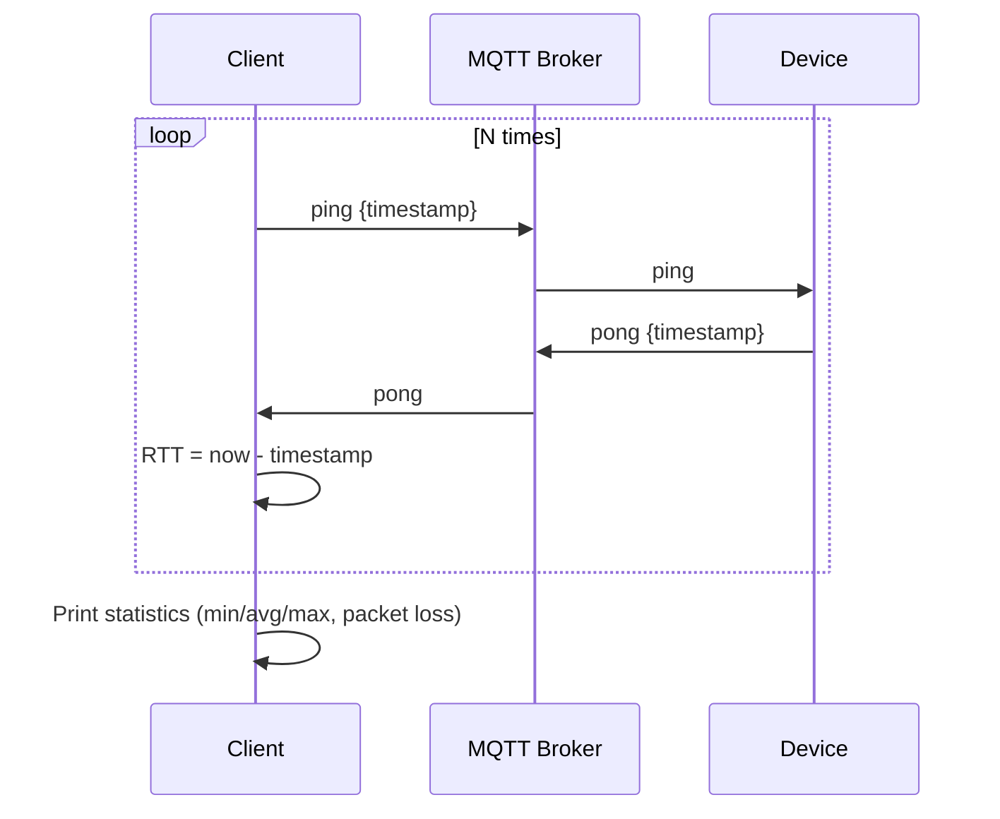
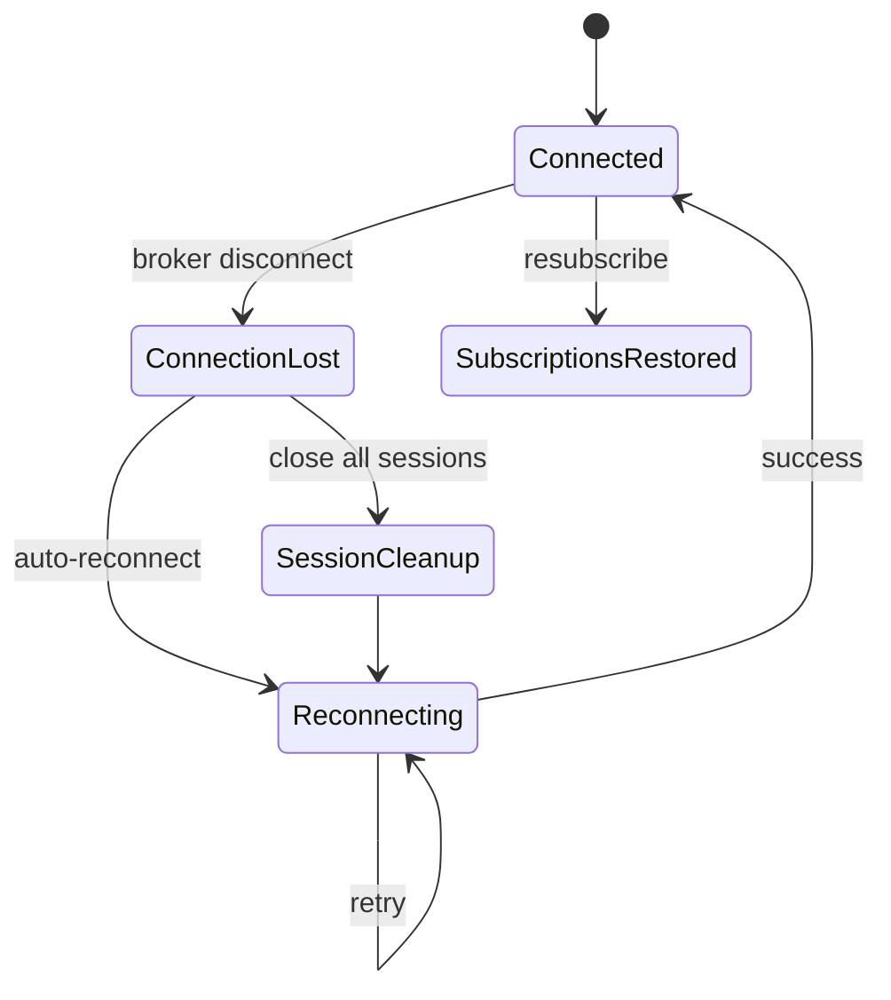

# mqtt-forward

On-demand TCP and shell tunneling over MQTT v5. Two peers -- client and device -- communicate through an MQTT broker. The client initiates tunnel requests; the device accepts them and connects to local services or spawns shells. Access control is delegated entirely to MQTT broker topic ACLs.

## Architecture



## Session Modes

| Mode | Description |
|------|-------------|
| `tcp` | Bidirectional TCP forwarding to a target host:port on the device |
| `socks5` | SOCKS5 proxy -- dynamic target resolution per connection |
| `shell` | Interactive PTY shell session on the device |
| `exec` | One-shot command execution with stdout and exit code |
| `ping` | Latency and availability probe |

## Usage

Device mode (runs on the target machine):

```sh
mqtt-forward device
mqtt-forward device --device-id my-device
```

Client mode (runs on the machine initiating connections):

```sh
mqtt-forward client ping --device my-device
mqtt-forward client exec --device my-device --command "uname -a"
mqtt-forward client shell --device my-device
mqtt-forward client tcp --device my-device --target localhost:22 --listen :2222
mqtt-forward client socks5 --device my-device --listen :1080
```

## MQTT Topics

All messages use QoS 1. Topic structure:

```
tunnel/{device_id}/in/control           -- control messages to device
tunnel/{device_id}/in/data/{session_id} -- data frames to device
tunnel/{device_id}/out/control          -- control messages from device
tunnel/{device_id}/out/data/{session_id} -- data frames from device
```

- `{device_id}` -- target device identifier
- `in` -- messages directed to the device (client publishes, device subscribes)
- `out` -- messages from the device (device publishes, client subscribes)
- `{session_id}` -- UUID identifying a single tunnel session

### Subscription Patterns

Device subscribes to:

```
tunnel/{device_id}/in/control
tunnel/{device_id}/in/data/+
```

Client subscribes to:

```
tunnel/{device_id}/out/control
tunnel/{device_id}/out/data/+
```

No wildcard `#` subscriptions are used -- all patterns are strict and ACL-friendly.

### Broker ACL Example

Minimal ACL rules to allow a client to tunnel to device `d1`:

```
# Client: publish requests TO device d1
topic write tunnel/d1/in/control
topic write tunnel/d1/in/data/+

# Client: subscribe to responses FROM device d1
topic read tunnel/d1/out/control
topic read tunnel/d1/out/data/+

# Device d1: subscribe to incoming requests
topic read tunnel/d1/in/control
topic read tunnel/d1/in/data/+

# Device d1: publish responses
topic write tunnel/d1/out/control
topic write tunnel/d1/out/data/+
```

## Protocol

### Control Messages

JSON-encoded messages on control topics:

```json
{
  "type": "open",
  "session_id": "uuid",
  "mode": "tcp|shell|exec",
  "target": "host:port",
  "command": "shell command",
  "cols": 80,
  "rows": 24,
  "success": true,
  "error": "message",
  "exit_code": 0,
  "ack_bytes": 65536,
  "timestamp": 1234567890
}
```

Fields are omitted when not applicable (using `omitempty`).

### Message Types

| Type | Direction | Description |
|------|-----------|-------------|
| `open` | client -> device | Request to open a new session |
| `open_ack` | device -> client | Accept or reject with `success` and optional `error` |
| `close` | bidirectional | Tear down a session, optionally with `exit_code` |
| `resize` | client -> device | Update terminal size (`cols`, `rows`) for shell sessions |
| `ack` | bidirectional | Flow control acknowledgment (`ack_bytes`) |
| `ping` | client -> device | Availability and latency probe |
| `pong` | device -> client | Echo back with same `session_id` and `timestamp` |

### Data Framing

Binary payloads on data topics:

```
[4 bytes: big-endian sequence number][payload: up to 64 KB]
```

- Sequence numbers are per-session, starting at 0
- Receiver maintains a 64-slot reorder buffer for out-of-order delivery
- Sessions are torn down if gaps persist beyond timeout

### Flow Control

Credit-based window mechanism:

- Window size: 256 KB
- Receiver periodically sends `ack` control messages with total bytes consumed
- Sender pauses when unacknowledged bytes exceed the window

## Flows

### TCP Tunnel



### Shell Session



### Command Execution



### Ping



### Reconnection



On connection loss, all active sessions are torn down. The MQTT client reconnects automatically with unlimited retries. Subscriptions are restored on reconnect via the broker-side session or client-side resubscription.

## Configuration

All settings are configured via environment variables:

| Variable | Description | Default |
|----------|-------------|---------|
| `MQTT_BROKER` | Broker URL | `tcp://localhost:1883` |
| `MQTT_CLIENT_ID` | MQTT client identifier (defaults to hostname) | (hostname) |
| `MQTT_DEVICE_ID` | Device identifier (required for device mode) | (empty) |
| `MQTT_USERNAME` | MQTT username | (empty) |
| `MQTT_PASSWORD` | MQTT password | (empty) |
| `MQTT_KEEP_ALIVE` | Keep-alive interval in seconds | `60` |
| `MQTT_TLS_CERT` | Path to TLS client certificate | (empty) |
| `MQTT_TLS_KEY` | Path to TLS client private key | (empty) |
| `MQTT_TLS_CA` | Path to TLS CA certificate | (empty) |

When connecting to AWS IoT Core (`*.iot.*.amazonaws.com`) on port 443, the ALPN protocol is set automatically based on the URL scheme:

For `tls://`, `ssl://`, or `tcps://` schemes, ALPN is set to `x-amzn-mqtt-ca`. WebSocket (`wss://`) does not need ALPN.

### AWS IoT Core Example

MQTT over TLS:

```sh
curl -o AmazonRootCA1.pem https://www.amazontrust.com/repository/AmazonRootCA1.pem

export MQTT_BROKER=tls://ENDPOINT.iot.REGION.amazonaws.com:443
export MQTT_TLS_CERT=/path/to/device.cert.pem
export MQTT_TLS_KEY=/path/to/device.private.key
export MQTT_TLS_CA=/path/to/AmazonRootCA1.pem
export MQTT_DEVICE_ID=my-device

mqtt-forward device
```

MQTT over WebSocket Secure:

```sh
export MQTT_BROKER=wss://ENDPOINT.iot.REGION.amazonaws.com:443/mqtt
export MQTT_TLS_CERT=/path/to/device.cert.pem
export MQTT_TLS_KEY=/path/to/device.private.key
export MQTT_TLS_CA=/path/to/AmazonRootCA1.pem
export MQTT_DEVICE_ID=my-device

mqtt-forward device
```

## Constants

| Parameter | Value |
|-----------|-------|
| Max payload per MQTT message | 64 KB |
| Data frame header size | 4 bytes |
| Reorder buffer slots | 64 |
| Flow control window | 256 KB |
| Stale session timeout | 5 minutes |
| Open ack timeout | 10 seconds |
| MQTT QoS | 1 (at least once) |
