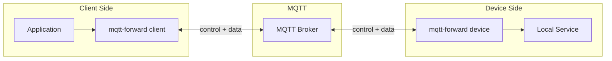

# Architecture

## Session Modes

| Mode | Description |
|------|-------------|
| `tcp` | Bidirectional TCP forwarding to a target host:port on the device |
| `socks5` | SOCKS5 proxy - dynamic target resolution per connection |
| `shell` | Interactive PTY shell session on the device |
| `exec` | One-shot command execution with stdout and exit code |
| `ping` | Latency and availability probe |
