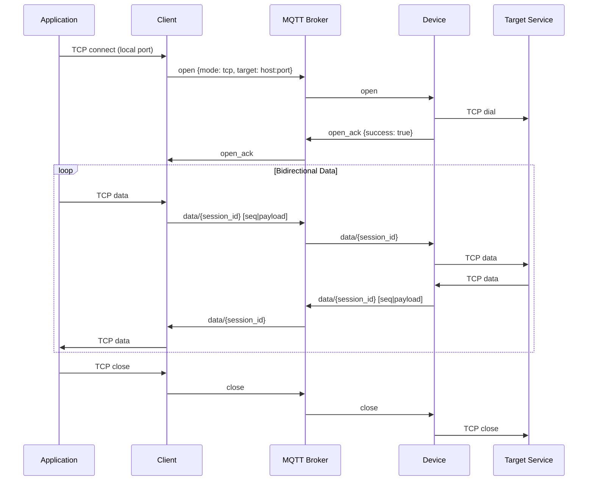
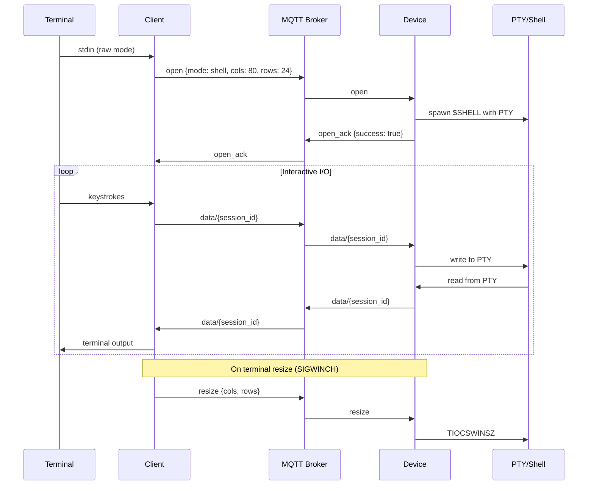
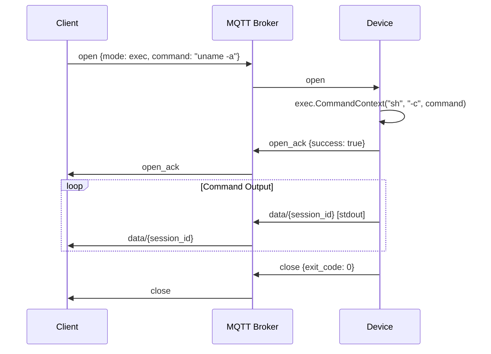
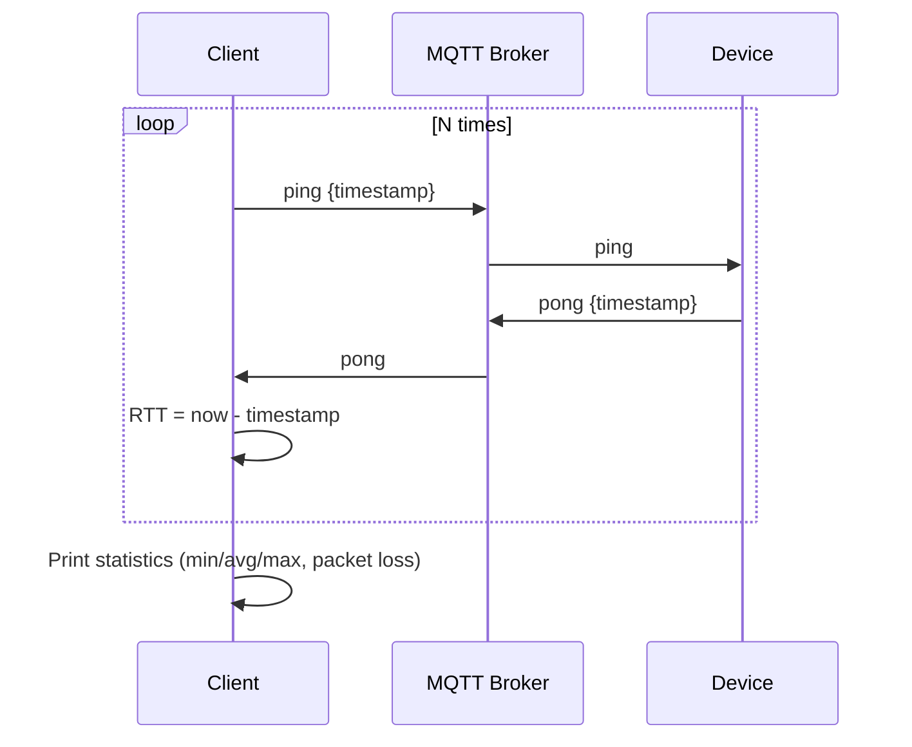
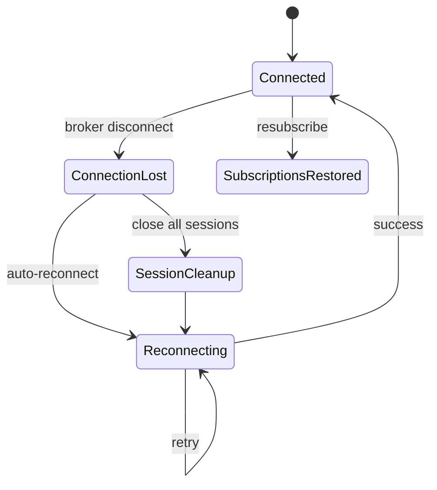

# Flows

## TCP Tunnel

## Shell Session

## Command Execution

## Ping

## Reconnection

On connection loss, all active sessions are torn down. The MQTT client reconnects automatically with unlimited retries. Subscriptions are restored on reconnect via the broker-side session or client-side resubscription.
